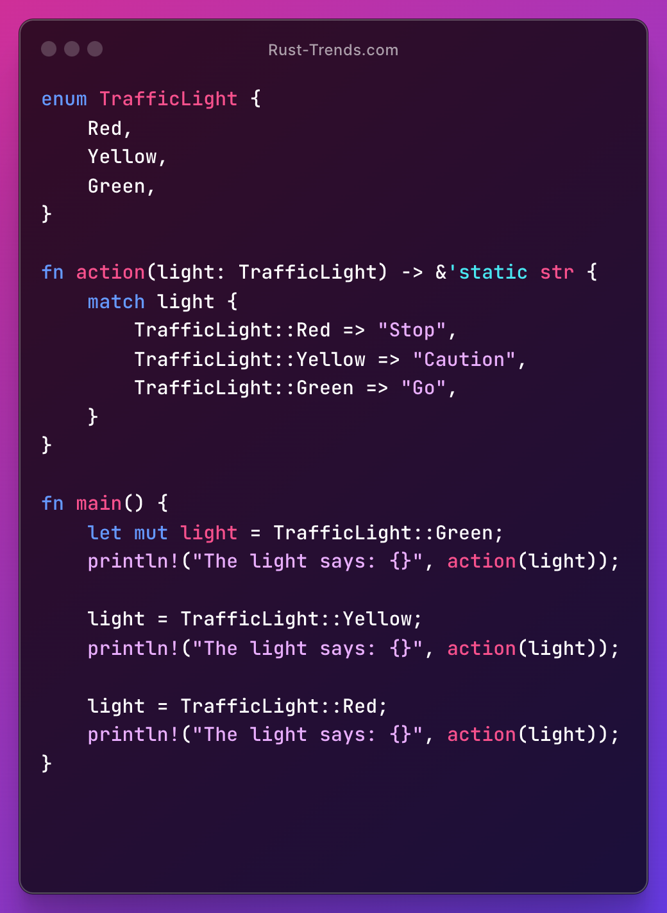

+++
title = "Unpacking Rust's match Operator with Community Insights"
date = "2024-04-26"
slug = "Unpacking Rust's match Operator with Community Insights"
description = "Explores the usage of the match operator in Rust, discusses community feedback on a shared code snippet, and presents several code improvements."
+++

# Introduction
In the dynamic world of software development, sharing and <a href="https://www.linkedin.com/feed/update/urn:li:activity:7188597915068608512?utm_source=share&utm_medium=member_desktop" target="_blank">discussing code snippets on platforms like LinkedIn</a> can provide immense value, both through receiving insightful feedback and fostering community engagement. This post is inspired by an (overly) simplified Rust example using the match operator — a powerful tool in Rust's arsenal. Below, I'll break down the code snippet I posted, explore the constructive feedback received, and discuss general tips for writing better Rust code shared by our community.

# The Original Code Snippet
Here's a brief code snippet to illustrate the usage of the match operator in Rust:

```rust
enum TrafficLight {
    Red,
    Yellow,
    Green,
}

fn action(light: TrafficLight) -> &'static str {
    match light {
        TrafficLight::Red => "Stop",
        TrafficLight::Yellow => "Caution",
        TrafficLight::Green => "Go",
    }
}

fn main() {
    let mut light = TrafficLight::Green;
    println!("The light says: {}", action(light));
    
    light = TrafficLight::Yellow;
    println!("The light says: {}", action(light));
    
    light = TrafficLight::Red;
    println!("The light says: {}", action(light));
}
```
Playground <a href="https://play.rust-lang.org/?version=stable&mode=debug&edition=2021&gist=44e42a468bc89c711643299885e88533" target="_blank">link</a>

__Use of match for Control Flow:__ The match operator is akin to a switch statement but more powerful. It allows a value to be compared against a series of patterns and execute code based on which pattern matches. This is particularly useful for enums in Rust, as demonstrated in our TrafficLight example.

# Elevate Your Rust Skills with CodeCrafters! 🚀 [advertisement]
Join us in partnership with CodeCrafters to build your own HTTP server for FREE! Sign up easily with GitHub—no payment info required.

📅 Hurry, as April's special offer is ending soon! WIN one of two yearly subscriptions worth $990 each. Plus, subscribers receive a 40% discount on all paid plans.

Don't miss out—enhance your skills and win big. <a href="https://app.codecrafters.io/join?via=Rust-Trends" target="_blank">Sign up now</a>

P.S. it helps us to keep the lights on and continue to provide valuable content and for you it is FREE. Thank you for your support! 🙏

Let's continue with the article!

# Community Insights
The LinkedIn post generated a lot of engagement, with several community members sharing their thoughts and suggestions. Here are some key insights:

## Eliminate `Mutable` Declaration
One community member suggested eliminating the need for a mutable declaration for `light` by only assigning it once. This can be achieved by using a loop to iterate over the values of the enumeration and printing directly within the iteration without reassigning `light`.

My interpretation of this suggestion is as follows:

```rust
enum TrafficLight {
    Red,
    Yellow,
    Green,
}

// Update the function signature to take a reference
fn action(light: &TrafficLight) -> &'static str {
    match *light {  // Dereference here to match against the enum variants
        TrafficLight::Red => "Stop",
        TrafficLight::Yellow => "Caution",
        TrafficLight::Green => "Go",
    }
}

fn main() {
    for light in &[TrafficLight::Green, TrafficLight::Yellow, TrafficLight::Red] {
        // Pass a reference to `action`, no need to dereference here
        println!("The light says: {}", action(light));
    }
}
```

Playground <a href="https://play.rust-lang.org/?version=stable&mode=debug&edition=2021&gist=ec71038ae74ab6610cbb48d1cb92810e" target="_blank">link</a>

Explanation of Key Parts:
- __Function Signature:__ The `action` function now accepts a reference to a `TrafficLight` (&TrafficLight) instead of owning it. This is a more flexible approach, especially when you don't need to take ownership of the value.
- __Matching Inside action:__ Inside the `action` function, the match statement now needs to dereference the light argument to access the enum values (*light).

## Implement `Display` Trait
Another community member suggested implementing the Display trait for the `TrafficLight` enum to allow for more readable output. 

This can be achieved by adding the following code:

```rust
// Trait to allow custom formatting of the enum variants.
use std::fmt;

enum TrafficLight {
    Red,
    Yellow,
    Green,
}

// Implement the Display trait for TrafficLight.
impl fmt::Display for TrafficLight {
    fn fmt(&self, f: &mut fmt::Formatter<'_>) -> fmt::Result {
        let text = match self {
            TrafficLight::Red => "Stop",
            TrafficLight::Yellow => "Caution",
            TrafficLight::Green => "Go",
        };
        write!(f, "{}", text)
    }
}

fn main() {
    for light in &[TrafficLight::Green, TrafficLight::Yellow, TrafficLight::Red] {
        // Automatically uses the Display trait for printing.
        println!("The light says: {}", light);
    }
}
```
Playground <a href="https://play.rust-lang.org/?version=stable&mode=debug&edition=2021&gist=9df958812ad767f59466c88ba0462014" target="_blank">link</a>

Documentation <a href="https://doc.rust-lang.org/std/fmt/trait.Display.html" target="_blank">std::fmt</a>

Explanation of Key Parts:
- **Use Statement:** The use std::fmt; is necessary to bring the fmt module into scope, which contains the `Display` trait and `Formatter` struct needed for implementing custom display behavior.
- **Implementing Display:** The `impl fmt::Display` for `TrafficLight` block defines how to convert each variant of the `TrafficLight` enum to a String. The method fmt takes a mutable reference to a `Formatter` object and returns a `Result` that indicates whether the operation was successful or not.
- **Match Statement:** Inside the fmt method, a match expression determines what string corresponds to each enum variant.
`write!` Macro: This macro is used to write the formatted string into the provided buffer (f), which is part of the functionality provided by the `Formatter`.


## Use the crates `strum` and `strum_macros`
Yes, you probably thought it already — if you are doing something like this in Rust, there's a crate for that! Turns out strum is here, and a helpful community member pointed out that it can be used to simplify the code. `strum` and its companion `strum_macros` bring additional functionalities that make working with enums much more flexible and expressive.

Here is how you can use it, my interpretation of the suggestion:

```rust
// Trait to allow iteration over the enum variants.
use strum::IntoEnumIterator;
// Macros to derive display and iterator functionalities.
use strum_macros::{Display, EnumIter};  

#[derive(EnumIter, Display)]
enum TrafficLight {
    #[strum(serialize = "Stop")]
    Red,
    #[strum(serialize = "Caution")]
    Yellow,
    #[strum(serialize = "Go")]
    Green,
}

fn main() {
    // Use the iter() function provided by EnumIter.
    for light in TrafficLight::iter() {
        // Automatically uses the Display trait for printing.
        println!("The light says: {}", light);  
    }
}
```
Documentation <a href="https://docs.rs/strum/latest/strum/" target="_blank">strum</a>

This code snippet leverages `strum` to automatically implement the `Display` trait for the `TrafficLight` enum, customizing the output string for each variant using the `serialize` attribute. Moreover, `EnumIter` is used to create an iterator over the enum, which simplifies looping through its values. This combination not only reduces boilerplate but also enhances the readability and maintainability of your code. Thanks to `strum`, managing enums in Rust becomes a breeze, focusing more on what you want your code to do rather than how to set up basic functionalities.


## Encapsulate Behavior within the Enum
A suggestion from another community member highlighted a more integrated approach: they prefer to encapsulate the behavior directly within the enum. Additionally, they recommended making the `action` function constant (const). 

Here’s an implementation based on that suggestion:

```rust
use strum::IntoEnumIterator;
use strum_macros::EnumIter;
#[derive(EnumIter)]
enum TrafficLight {
    Red,
    Yellow,
    Green,
}

// Implementing a constant function action for the TrafficLight enum.
impl TrafficLight {
    const fn action(&self) -> &'static str {
        match self {
            TrafficLight::Red => "Stop",
            TrafficLight::Yellow => "Caution",
            TrafficLight::Green => "Go",
        }
    }
}

fn main() {
    for light in TrafficLight::iter() {
        // Use the constant function action directly on the enum variant.
        println!("The light says: {}", light.action());
    }
}
```
Note in this example I am still using `strum` to iterate over the enum variants, because it makes the code more concise and readable.

## How to generate such great code snippets?



One community member asked how to generate such great code snippets images I use ray.so for generating code snippets. It's a fantastic tool for creating beautiful code images for sharing on social media platforms like LinkedIn, Twitter, etc. You can check it out <a href="https://ray.so/" target="_blank">here</a>.


# Conclusion
Sharing code snippets and engaging with the community can lead to valuable insights and improvements in your coding practices. By exploring the feedback and suggestions provided by the community, you can enhance your understanding of Rust and learn new ways to write more efficient and readable code. Remember, the Rust community is always ready to help and share knowledge, so don't hesitate to participate and contribute to the vibrant ecosystem of Rust developers.

While the match operator was the main focus, the ensuing discussions and improvements turned out to be even more intriguing and significant.

Happy coding! 🦀

P.s. if you have any questions or suggestions, feel free to drop me a message. Let's keep the conversation going! Do not forget to sign up for my newsletter 🚀
